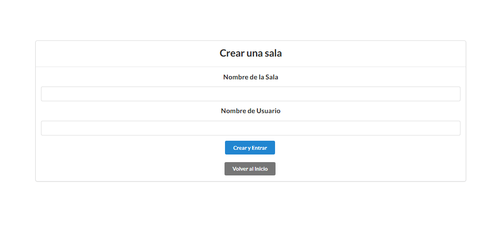
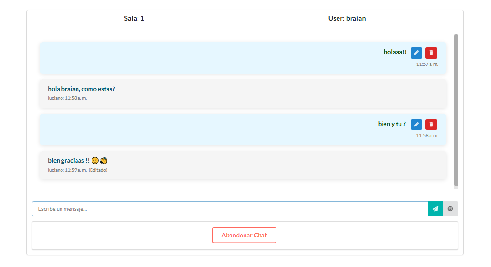

# **Chat Application**

## **Descripción**

Este proyecto es una **aplicación de chat en tiempo real** que permite a los usuarios enviar, modificar y eliminar mensajes. Además, incluye un **selector de emojis** que se abre junto al campo de texto para mejorar la experiencia de usuario. El chat cuenta con un sistema de **"está escribiendo..."** para indicar cuándo un usuario está escribiendo un mensaje.

## **Características**

- **Envío de mensajes en tiempo real**: Los usuarios pueden enviar mensajes instantáneamente en el chat.
- **Edición y eliminación de mensajes**: Los usuarios pueden modificar o eliminar mensajes que ya han enviado.
- **Selector de emojis**: Los usuarios pueden seleccionar emojis para agregar a sus mensajes, lo que mejora la interacción.
- **Indicador de 'está escribiendo'**: Muestra un mensaje que indica cuando otro usuario está escribiendo

## **Tecnologías Utilizadas**

- **Frontend**: React, CSS, React Router, Emojis Selector
- **Backend**: Node.js, Express (si aplica), WebSockets o Socket.io (para la funcionalidad en tiempo real)
- **Base de datos**: MongoDB

## **Instalación**

1. **Clona este repositorio**:

   ```bash
   git clone https://github.com/BraianChebib/chat.git
   ```

2. **Ve al directorio del proyecto**:

   ```bash
   cd chat
   ```

3. **Instala las dependencias**:

   ```bash
   npm install
   ```

4. **Si estás utilizando un servidor de backend** (como Node.js), asegúrate de configurar las variables de entorno necesarias.

5. **Inicia el proyecto (api)**:

   ```bash
   npm start
   ```

6. **Inicia el proyecto (client)**:

   ```bash
   npm run dev
   ```

## **Uso**

1. Abre el navegador y navega a `http://localhost:3000` para ver la aplicación en funcionamiento.
2. Puedes probar el chat en tiempo real abriendo varias pestañas o diferentes navegadores.

## **Capturas de pantalla**




## **Contribución**

Si deseas contribuir al proyecto, por favor sigue estos pasos:

1. Haz un fork del repositorio.
2. Crea una rama nueva:
   ```bash
   git checkout -b nueva-caracteristica
   ```
3. Realiza los cambios.
4. Haz un commit de tus cambios:
   ```bash
   git commit -am 'Añadir nueva característica'
   ```
5. Empuja tus cambios al repositorio remoto:
   ```bash
   git push origin nueva-caracteristica
   ```
6. Abre un pull request en este repositorio.

## **Licencia**

Este proyecto está licenciado bajo la **MIT License**.
